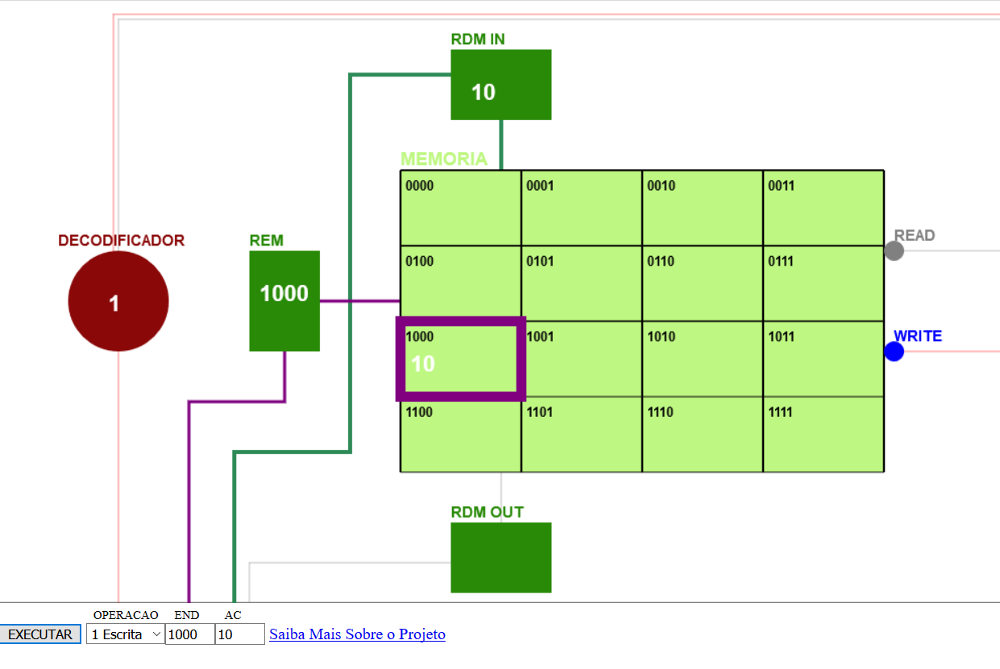

# SimMemoria
É um simulador de operações de leitura e escrita em memória. Desenvolvido como projeto de monitoria de arquiteturas de computadores
da Universidade Federal do Pampa (UNIPAMPA) para facilitar o ensino e a aprendizagem de tais conceitos.

